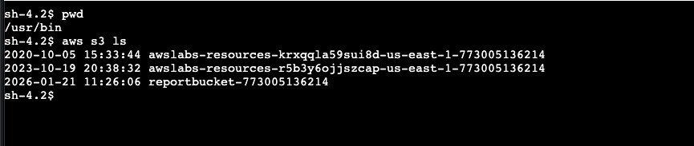
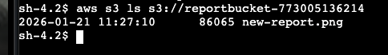

# S3
Amazon Simple Storage Service (Amazon S3) is an object storage service that offers industry-leading scalability, data availability, security, and performance. This means customers of all sizes and industries can use it to store and protect any amount of data for a range of use cases, such as websites, mobile applications, backup and restore, archive, enterprise applications, Internet of Things (IoT) devices, and big data analytics. Amazon S3 provides easy-to-use management features so you can organize your data and configure finely-tuned access controls to meet your specific business, organizational, and compliance requirements. Amazon S3 is designed for 99.999999999% (11 9’s) of durability and stores data for millions of applications for companies all around the world.

### Bucket name rules
- Bucket names must be between 3 and 63 characters long 
- Consist of only lowercase letters, numbers, or hyphens. 
- The bucket name must be globally unique across all of Amazon S3, regardless of account or region, and cannot be changed after the bucket is created.

### Security
- Security is a priority in Amazon S3. Default security of S3 is private
- Public access is blocked by `Block Public Access settings` are turned on for this bucket.
- The bucket settings override any permissions applied to individual objects.
- When public read access is enabled and not blocked by Block Public Access settings, anyone in the world can access the specified objects.
- If you wish to grant access to the entire bucket, you need to use a bucket policy.

### aws cli to use s3
Simple commands, just to show that we could use the AWS CLI from S3 directly.   

- `aws s3 ls` (to list all of your buckets).  

- `aws s3 ls s3://<BUCKET_NAME>` (to list all objects in your bucket).  

- `aws s3 cp report-test1.txt s3://<BUCKET_NAME>` (to copy objects from bucket)

#### bucket policy
A bucket policy is a set of permissions associated with an S3 bucket. It is used to control access to an entire bucket or to specific directories within a bucket.
If you want, you can use [AWS Policy Generator](https://awspolicygen.s3.amazonaws.com/policygen.html) to create a bucket policy

-  Policy of the bucket policy to allow acces to all objects
    ```
    {
        "Version": "2012-10-17",
        "Statement": [
            {
                "Sid": "PublicReadGetObject",
                "Effect": "Allow",
                "Principal": "*",
                "Action": "s3:GetObject",
                "Resource": "arn:aws:s3:::<BUCKET_NAME>/*"
            }
        ]
    }
    ```

- Example of policy to allow EC2 to get and upload files to the bucket
    ```
    {
        "Version": "2012-10-17",
        "Statement": [
            {
                "Sid": "Statement1",
                "Effect": "Allow",
                "Principal": {
                    "AWS": "arn:aws:iam::<ACCOUNT_ID>:role/EC2InstanceProfileRole"
                },
                "Action": [
                    "s3:PutObject",
                    "s3:GetObject"
                ],
                "Resource": "arn:aws:s3:::<BUCKET_NAME>/*"
            }
            ... more statements
        ]
    }
    ```
- Policy with more than one statement, allow ec2 and allow public access
    ```
    {
        "Version": "2012-10-17",
        "Statement": [
            {
                "Sid": "Statement1",
                "Effect": "Allow",
                "Principal": {
                    "AWS": "arn:aws:iam::<ACCOUNT_ID>:role/EC2InstanceProfileRole"
                },
                "Action": [
                    "s3:PutObject",
                    "s3:GetObject"
                ],
                "Resource": "arn:aws:s3:::<BUCKET_NAME>/*"
            },
            {
                "Sid": "Stmt1604428842806",
                "Effect": "Allow",
                "Principal": "*",
                "Action": "s3:GetObject",
                "Resource": "arn:aws:s3:::<BUCKET_NAME>/*"
            }
            ... more statements if want
        ]
    }
    ```

### Versioning
Versioning is a means of keeping multiple variants of an object in the same bucket. You can use versioning to preserve, retrieve, and restore every version of every object stored in your Amazon S3 bucket. With versioning, you can easily recover from both unintended user actions and application failures.  

- Versioning is enabled for an entire bucket and all objects within the bucket. It cannot be enabled for individual objects.
- There are also cost considerations when enabling versioning.
- Amazon S3 always returns the latest version of an object if a version is not otherwise specified.
- You will receive an access denied message when try to access old versions. This is expected because the bucket policy needs to allow permission to access old versions in the bucket.
```
{
    "Sid": "Stmt1604428842806",
    "Effect": "Allow",
    "Principal": "*",
    "Action": ["s3:GetObject", "s3:GetObjectVersion"],
    "Resource": "arn:aws:s3:::<BUCKET_NAME>/*"
}
```

### Access point
An S3 Access Point is a named network endpoint that provides controlled access to a specific S3 bucket, with its own permissions and network rules.
Instead of managing all access rules directly on the bucket policy (which can get messy fast), you create multiple access points, each one tailored to a specific application, team, or use case.  

> Think of it like   
> **One bucket, multiple “doors”, each door with its own lock and rules.**


with access point one bucket can have:
- Multiple access points
- Each access point has:
- Its own IAM policy

Example IAM policy per access point:   
```
{
  "Version": "2012-10-17",
  "Statement": [
    {
      "Effect": "Allow",
      "Action": ["s3:GetObject"],
      "Resource": "arn:aws:s3:region:account-id:accesspoint/<bucket>/object/*"
    }
  ]
}
```

#### When should you use Access Points?
- Multiple applications share the same bucket
- You want clean separation of permissions
- Bucket policies are becoming hard to maintain

#### When you don’t need them
- Simple setup
- One application, one bucket
- No complex permission model