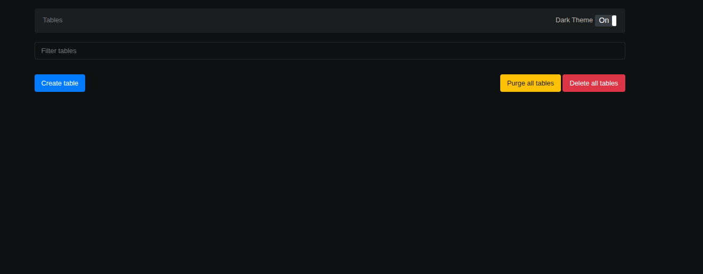
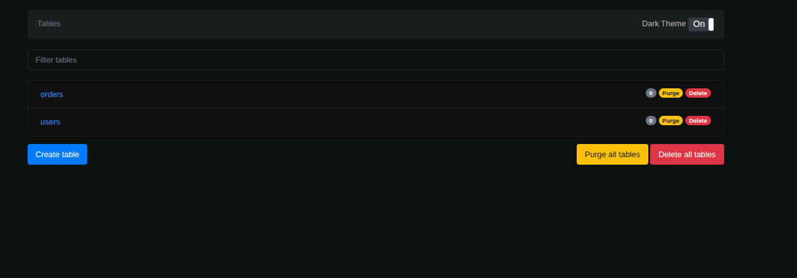

# DynamoDB Local

Local DynamoDB environment using Docker and Terraform.

- DynamoDB Local | http://localhost:8000 (api)
- DynamoDB Admin | http://localhost:8001 (web ui)




### Start the containers

```bash
docker compose up -d
```

### Provision tables with Terraform

```bash
cd terraform
tofu init
tofu plan
tofu apply -auto-approve
```

This creates two example tables:
- **users** — partition key: `user_id` (String)
- **orders** — partition key: `order_id` (String), 
  - sort key: `created_at` (String), 
  - GSI on `user_id`

### Verify tables were created

```bash
aws dynamodb list-tables \
  --endpoint-url http://localhost:8000 \
  --region us-east-1 \
  --no-sign-request
```

## Usage Examples

### Put an item

```bash
aws dynamodb put-item \
  --endpoint-url http://localhost:8000 \
  --region us-east-1 \
  --no-sign-request \
  --table-name users \
  --item '{"user_id": {"S": "u1"}, "name": {"S": "Alice"}}'
```

### Get an item

```bash
aws dynamodb get-item \
  --endpoint-url http://localhost:8000 \
  --region us-east-1 \
  --no-sign-request \
  --table-name users \
  --key '{"user_id": {"S": "u1"}}'
```

### Scan a table

```bash
aws dynamodb scan \
  --endpoint-url http://localhost:8000 \
  --region us-east-1 \
  --no-sign-request \
  --table-name users
```

## Tear Down

```bash
cd terraform && tofu destroy -auto-approve
```

```bash
docker compose down
# To also delete persisted data:
docker compose down -v
```

## What s dynamodb?
IS a serverless, fully managed, distributted nosql database with single-digit millisecond performance at any scale.


### Serverless
You don't need to provision any servers, or pattch, omanage, install, maintain, or operate any software. Zero downtime maintenance. There are no maintenance windows.

On demand capacity mode offers pay-as-you-go pricing for read and write requests so you only pay for what you use. With on demand, dynamo instatly scales up or down your tables to adjust for capacity and maintains performance with zero administration. Itt also scales down to zero so you don't pay for throughput when your table doesn't have traffic and there are no cold starts.

### NoSQL
As a NoSQL database, it was purpose built to deliver improved performance, scalablity, manageability, and flexbility compared to traditional relational databases. To support a wide variety of use cases, Dynamodb supports both key value and document data models.

Unlike relational databases, dynamodb doesn't support a join operator. We recommend that you denormalize your data model to reduce database round trips and processing power needed tto answer queries. As nosql database, dynamodb provides strong read consistency and ACID transactions to build entterprise-grade applications.

### fully managed
As a fully managed db service, it handles the undifferentiated heavy lifting of manageing a database so that you can focus on building value for your customers. It handles setup, configurations, and maintenance, high availablility, hward provisioning, security, backups, monitoring, and more. 

## Capabilities of this db

### Multi-active replication with global tables
Global tables provide multi-active replicattion of your data across your chosen AWS regions witth 99.999% availability.
Global tables deliver a fully managed solution for deploying a multi-region, multi-active database, without building and maintaning your own replication solution.

### ACID transactions
It is built for mission-critical workloads. It includes acid transactions, support for applications that require complex business logic. Dynamodb provides native, server-side support for trtansactions, simplifying the developer experience of making coordinated, all-or-nothing changes to multiple items within and across tables.


### CDC for event-drive architectures
It supports streaming of item-level cdc records in near-real time. It offers two streaming models for cdc: streams and kinesis data streams for dynamodbc.
Whenever an application creates, updates, or deletes items in a table, streams records a time-ordered sequence of every ittem level change in near-real time. This makes dynamodb streams ideal for applications with event-driven archittecture to consume and actt upon the changes.

### Secondary indexes
It offers the option to create both global and local secondary indexes., which let you query the table data using an altternate key. With these secondary indexes, you can access datta with attributes other than tthe primary key, giving you maximum flexibility in accessing your data.

### service intetgrations
It droadly integrates with serveral AWS services to help you get more value from your data, eliminate undifferentiated heavy lifting, and operate your workloads att scale.

### serverless integrations
To build end-to-end serverless applications, it integrates natively with a number of serverless aws services. For example, you can integrate dynamodb with aws lamda to create triggers, which are pieaces of code that automatically respond to events in dynamodb streams. With trigger, you can build event drive napplications that react to data modifications in dnamodb tables. For cost optimization, yo ucan filter event that lamda processes from a dynamodb stream.

### importing and exporting data to amazon s3
Integrating dynamodb with amazon s3 enables you to easily export data to an amazon s3 bucket for analytics and machine learning.

### zero-etl integration
dyunamodb supportss zero etl integration with amazon redshift and using an operasearch ingestion pipeline with amazon dynamodb. These integrations eable you to run complex analytics and use advanced search capabilitites on your dynamodb table data.

### caching
Accelerator (dax) is a fully managed, highly available caching service built for dynamodb. Dax delivers up to 10 times performance improvement - from millis to micros - event at millions of requests per seconds.

### security
It utilizes iam to help you securely control access to your dynamodb resources. With iam, you can centrally manage permissions that control which dynamodb users can access resources. You use IAM to control who is authenticated (signed in) and authorized (has permissions) to use resources. Because dynamodb utilizes iam, there are no users names or passwords for accessing dynamodb. Because you don't have any complicated password rotatttion policies to manage, it simplifies your security posture. With iam, you can also enable fine-grained access control to provide authorization at the attribute level. you can also define resource-based policies with support for iam access analyzer and block public access bpa to simplify policy management.

### Resilience
By default, dynamo automatically replicates your dat across three availability zones to provide high durability and a 99,99% availability SLA. Dynamodb also provides additional capacitlities to help you achieve your business continuity and disaster recovery objectives.

### Table partitions and data disttribution in dynamodb
It stores data in partitions. A parttition is an allocation of stage for a table, backed by solid state drives (ssds) and automatically replicated across multiple availability zones within an aws region. Partition management is handled entirely by dynamodb-you never have to manage partitions yourself.

### Partittion key
If your table has a simple primary key (partition key only), dynamo stores and retrieves each item based on its partition key value.

To write an item to the table, dynamo uses the value of the partition kjey as input to an internal hash function. The output value from the hash function determines the partition in which the item will be stored.

To read an item from the table, you must specficy the partition key value for the item. Dynamodb uses this value as input to itts hash function, yielding the partition in which the item can be found.

### Parition key and sort key
If the table has a composite primary key (partition key and sort key), dynamo calculates the hash value of the partition key in the same way as described in partition key. However, it tends to keep items which have the same value of partition key close together and in sorted order by the sort key attribute's value. The set of items which have the same value of partition key is called an item collection. Item collections are optimized for effieicnet retrieval of ranges of the item within the collection. If your table doesn't have local secondary indexes, dynamodb will auttomatically split your item collection over as many partitions as required to store the data and to serve read and write throughput.

To write an item to the table, dynamo calculates the hash value of the partition key to determine which partition should contain the item. In that partition, several items could have the same partition key value. So dynamodb stores the item among the others with the same partition key, in ascending order by sort key.


### creating a table with dynamodb
```json
{
    TableName : "Music",
    KeySchema: [
        {
            AttributeName: "Artist",
            KeyType: "HASH" //Partition key
        },
        {
            AttributeName: "SongTitle",
            KeyType: "RANGE" //Sort key
        }
    ],
    AttributeDefinitions: [
        {
            AttributeName: "Artist",
            AttributeType: "S"
        },
        {
            AttributeName: "SongTitle",
            AttributeType: "S"
        }
    ],
    ProvisionedThroughput: {       // Only specified if using provisioned mode
        ReadCapacityUnits: 1,
        WriteCapacityUnits: 1
    }
}
```

### Table operations

#### describind the table
describe the stracuture of the table, with all of the column names, data types, and sizes.

| Field | Type | Null | Key | Default | Extra |
|--------|--------|--------|--------|--------|--------|
| Artist | varchar(20) | NO | PRI | NULL | |
| SongTitle | varchar(30) | NO | PRI | NULL | |
| AlbumTitle | varchar(25) | YES | | NULL | |
| Year | int(11) | YES | | NULL | |
| Price | float | YES | | NULL | |
| Genre | varchar(10) | YES | | NULL | |
| Tags | text | YES | | NULL | |

#### inserting
```sql
INSERT INTO Music
    (Artist, SongTitle, AlbumTitle,
    Year, Price, Genre,
    Tags)
VALUES(
    'No One You Know', 'Call Me Today', 'Somewhat Famous',
    2015, 2.14, 'Country',
    '{"Composers": ["Smith", "Jones", "Davis"],"LengthInSeconds": 214}'
);```

### creating index

```sql
CREATE INDEX GenreAndPriceIndex
ON Music (genre, price);
```

### read consistency

#### eventually consistent reads
It's the default read consistent model for all read op. When issuing it to a dynamodb table or an index, the responses may not reflect the results of a recently completed write operattion. If you repeat your read request after a short time, the response should eventually return the more recent item. Eventually consistent reads are supported on tables, local secondary indexes, and global secondary indexes. Also note tthat all reads from a dynamodb stream are also eventually consistent.

#### strongly consistent reads
Read operations such as getitem, query, and scan provide an optional consistentread parameter. If you set consisdent read to true, it returns a response with the most up-to-date data.


#### global tables read consistency
A global table is composed of multiple replica tables in different aws regions. Any change made to any item in any replica table is replicated to all the other replicas within the same global table, typically within a second, and are eventually consistent.


### indexes
Global and local indexes, these are additional indexes created on a table, in addition to existing hash an range indexes of the table. Global index is similiar to a hash. Range index behave similarly to the range index used with the hash of the table. n you entity model in your code, the getter must be annotated in this way

- For global indexes
 ```java
    @DynamoDBIndexHashKey(globalSecondaryIndexName = INDEX_GLOBAL_RANGE_US_TS)
    @DynamoDBAttribute(attributeName = PROPERTY_USER)
    public String getUser() {
        return user;
    }
```

- For range index associated to the global index
```java
    @DynamoDBIndexRangeKey(globalSecondaryIndexName = INDEX_GLOBAL_RANGE_US_TS)
    @DynamoDBAttribute(attributeName = PROPERTY_TIMESTAMP)
    public String getTimestamp() {
        return timestamp;
    }
```

**LSI** - allows you to perform a query on a single Hash-Key while using multiple different attributes to "filter" or restrict the query.

**GSI** - allows you to perform queries on multiple Hash-Keys in a table, but costs extra in throughput, as a result.

#### global secondary index
An index with a has and range key that can be different from those on the table. A global secondary index is considered "global" because queries on the index can span all of the data in a ttable, across all partitions.

#### local secondary index
An index that has the same hash key as the table, but a different range key. A local secondary index is "local" in the sense that every partition of  a local secondary index is scoped to a table partition that has the same has key.

> in order for a table write to succeed, the provisioned throughput settings for the table and
> all of its global secondary indexes must have enough write capacity to accommodate the write;
> otherwise, the write to the table will be throttled