# JSONB Basics

### JSON vs JSONB — What's the Difference?

| | JSON | JSONB |
|---|---|---|
| Storage | Raw text, preserves key order and whitespace | Binary format, decomposed on insert |
| Duplicate keys | Kept (all values preserved) | Removed (last value wins) |
| Key order | Guaranteed | Not guaranteed |
| Query speed | Slower | Significantly faster |
| Indexes | Not supported | Supported |

## Usage

```sql
-- JSON preserves duplicates and order:
SELECT '{"a": 1, "b": 2, "a": 99}'::JSON;
```
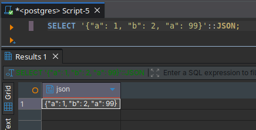

```sql
-- JSONB removes duplicates (last value wins) and may reorder keys:
SELECT '{"a": 1, "b": 2, "a": 99}'::JSONB;
```
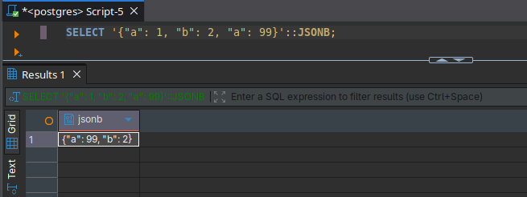

### Casting Text to JSONB

```sql
SELECT '{"name": "Alice", "age": 30}'::JSONB;

-- Equivalent using CAST():
SELECT CAST('{"name": "Alice", "age": 30}' AS JSONB);
```

### Selecting JSONB Columns

```sql
SELECT id, name, attrs FROM products LIMIT 3;
```
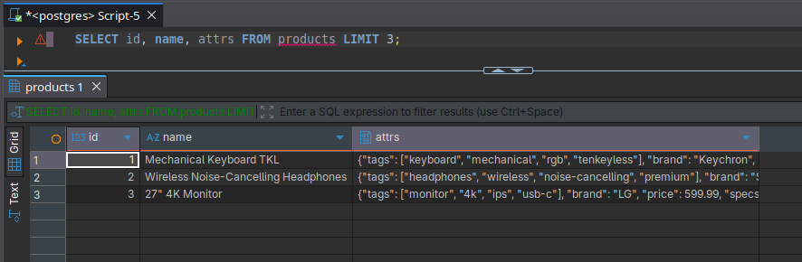
```sql
-- Pretty-print with jsonb_pretty():
SELECT id, name, jsonb_pretty(attrs) FROM products LIMIT 3;
```
below is the response from `jsonb_pretty`
```json
{
    "tags": [
        "keyboard",
        "mechanical",
        "rgb",
        "tenkeyless"
    ],
    "brand": "Keychron",
    "price": 119.99,
    "specs": {
        "backlight": "RGB",
        "weight_kg": 0.84,
        "switch_type": "Cherry MX Red",
        "connectivity": [
            "USB-C",
            "Bluetooth"
        ]
    },
    "ratings": {
        "count": 3812,
        "average": 4.7
    },
    "in_stock": true
}
```
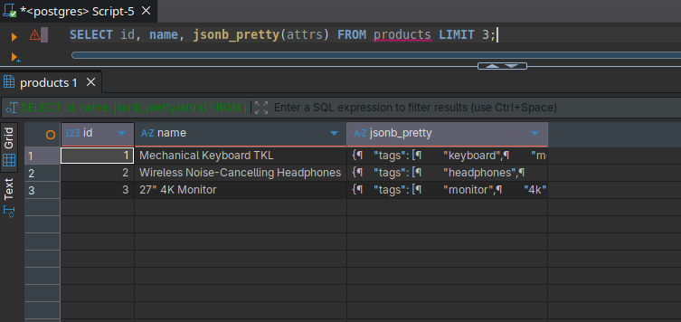

### Inspecting Types with `jsonb_typeof()`

Returns one of: `object`, `array`, `string`, `number`, `boolean`, `null`.

```sql
SELECT jsonb_typeof('{"key": "value"}'::JSONB);   -- object
SELECT jsonb_typeof('[1, 2, 3]'::JSONB);           -- array
SELECT jsonb_typeof('"hello"'::JSONB);             -- string
SELECT jsonb_typeof('42'::JSONB);                  -- number
SELECT jsonb_typeof('true'::JSONB);                -- boolean
SELECT jsonb_typeof('null'::JSONB);                -- null
```
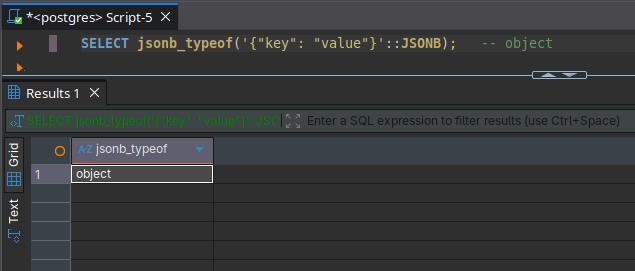
```sql
-- Check the type of a column and nested values:
SELECT
    id,
    name,
    jsonb_typeof(attrs)              AS attrs_type,
    jsonb_typeof(attrs->'tags')      AS tags_type,
    jsonb_typeof(attrs->'in_stock')  AS in_stock_type,
    jsonb_typeof(attrs->'price')     AS price_type
FROM products
LIMIT 5;
```
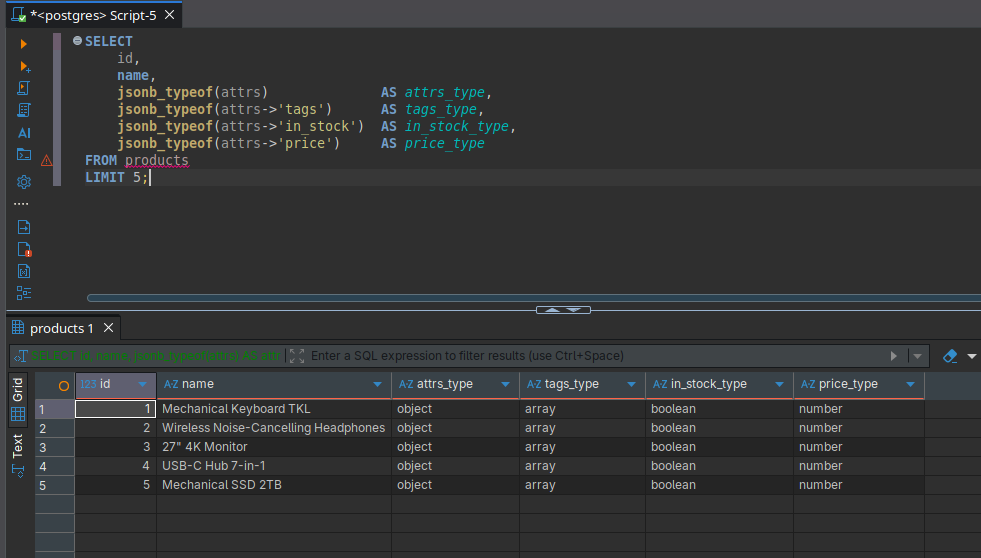

## Storing JSONB — Valid vs Invalid

JSONB rejects malformed JSON at insert time.

```sql
-- Valid
SELECT '{"valid": true}'::JSONB;

-- Invalid — raises an error:
SELECT '{bad json}'::JSONB;
-- ERROR: invalid input syntax for type json
```
```text
SQL Error [22P02]: ERROR: invalid input syntax for type json
  Detail: Token "bad" is invalid.
  Position: 8
  Where: JSON data, line 1: {bad...

Error position: line: 1 pos: 7
```
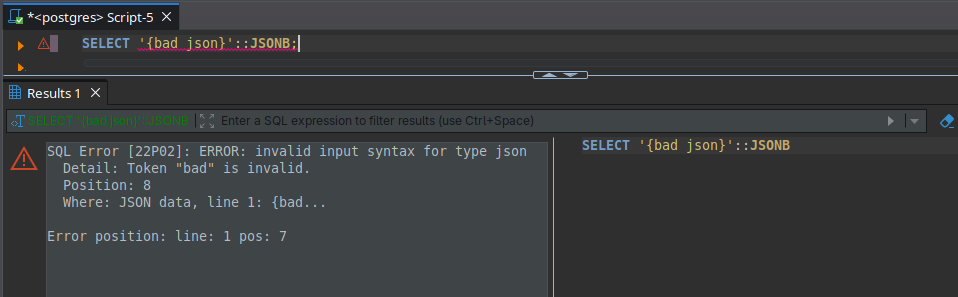

### NULL Handling in JSONB

There are two kinds of null: SQL `NULL` (column is absent) vs JSON `null` (explicit null value in the document).

```sql
-- The brand key is JSON null for books (the key exists but its value is null):
SELECT id, name, attrs->>'brand' AS brand_text
FROM products WHERE category = 'books' LIMIT 3;
```
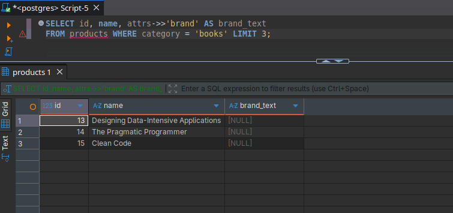
```sql
-- Returning JSONB instead of text shows the explicit null:
SELECT id, name, attrs->'brand' AS brand_jsonb
FROM products WHERE category = 'books' LIMIT 3;
-- brand_jsonb returns: null  (JSON null, rendered as text "null")
```
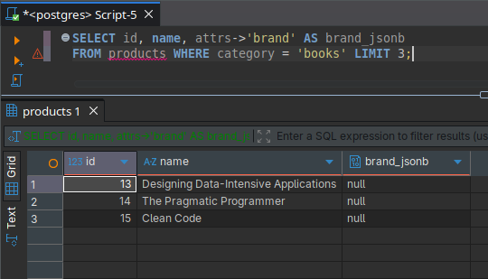

```sql
-- Filter rows where brand is explicitly JSON null:
SELECT id, name FROM products WHERE attrs->'brand' = 'null'::JSONB;
```
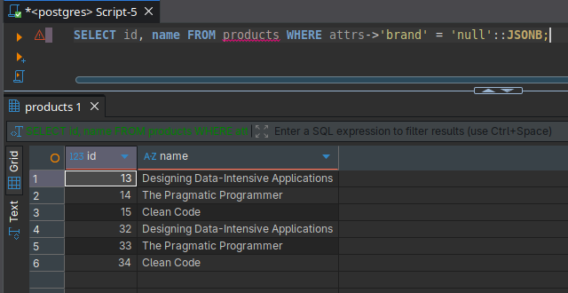
```sql
-- Filter rows where brand is JSON null OR the key is missing entirely:
SELECT id, name FROM products WHERE attrs->>'brand' IS NULL;
```
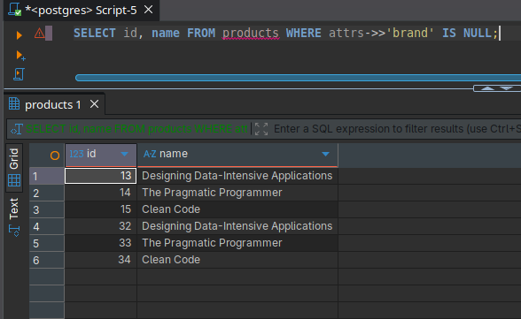

### Comparing JSONB Values

JSONB supports `=`, `<>`, `<`, `>`, `<=`, `>=`. Key order does not affect equality.

```sql
SELECT '{"a": 1}'::JSONB = '{"a": 1}'::JSONB;   -- true
SELECT '{"a": 1}'::JSONB = '{"a": 2}'::JSONB;   -- false
```
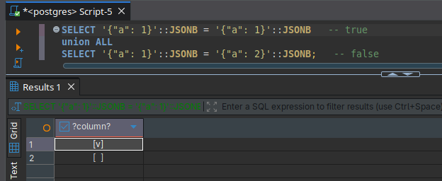
```sql
-- Key order doesn't matter:
SELECT '{"b": 2, "a": 1}'::JSONB = '{"a": 1, "b": 2}'::JSONB;  -- true
```
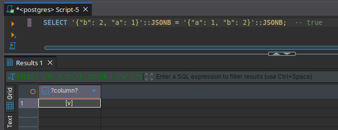

### Concatenation and Merging with `||`

The `||` operator merges two JSONB objects. On key conflict, the right side wins.

```sql
SELECT
    '{"name": "Alice", "city": "NYC"}'::JSONB
    ||
    '{"city": "London", "country": "UK"}'::JSONB;
```
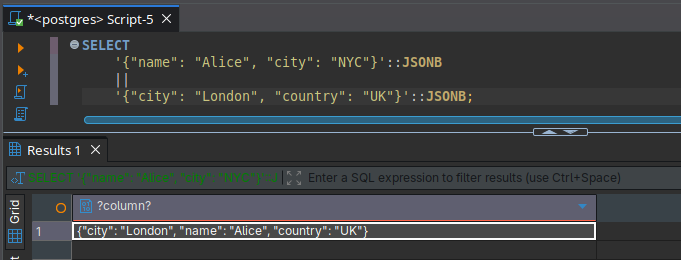

```sql
-- Add a field on the fly (read-only, not persisted):
SELECT
    id,
    name,
    attrs || '{"discount": 0.10}'::JSONB AS attrs_with_discount
FROM products
WHERE category = 'electronics'
LIMIT 3;
```
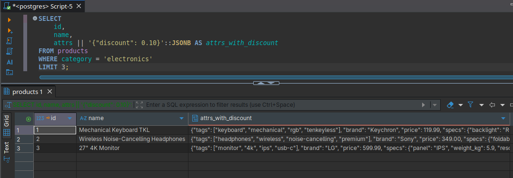
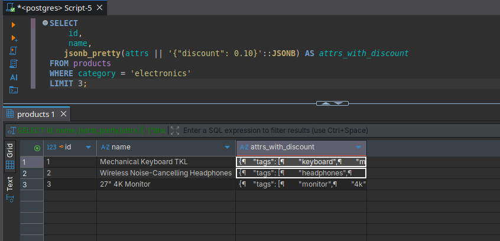
```json
{
    "tags": [
        "keyboard",
        "mechanical",
        "rgb",
        "tenkeyless"
    ],
    "brand": "Keychron",
    "price": 119.99,
    "specs": {
        "backlight": "RGB",
        "weight_kg": 0.84,
        "switch_type": "Cherry MX Red",
        "connectivity": [
            "USB-C",
            "Bluetooth"
        ]
    },
    "ratings": {
        "count": 3812,
        "average": 4.7
    },
    "discount": 0.10,
    "in_stock": true
}
```