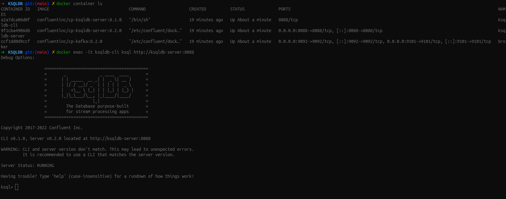
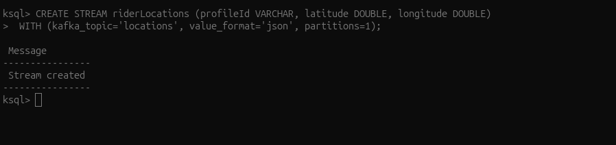
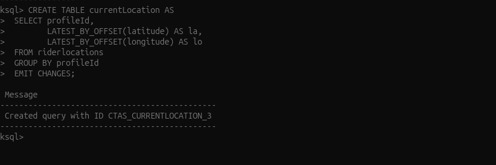
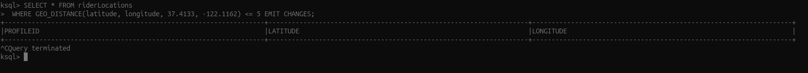

## What is ksqlDB? https://github.com/confluentinc/ksql

**[ksqlDB](https://github.com/confluentinc/ksql)** is a powerful streaming SQL engine for Apache Kafka that enables real-time data processing and analytics using familiar SQL syntax. It allows users to create, process, and query data streams and tables directly within Kafka, making it easier to build real-time applications and data pipelines without writing complex code in Java or Scala.

### Key Features
- **SQL for Streams:** Write SQL queries to filter, transform, aggregate, and join data streams in real time.
- **Stream and Table Abstractions:** ksqlDB treats data as both streams (continuous, unbounded data) and tables (stateful, updatable views).
- **Integration with Kafka:** Runs natively on Kafka, leveraging its scalability, durability, and fault tolerance.
- **Materialized Views:** Create persistent, continuously updated views of your data.
- **Event-Driven Applications:** Build applications that react to data changes as they happen.
- **REST API:** Manage and query ksqlDB using a RESTful interface.

### Pros
- **Easy to Use:** SQL syntax lowers the barrier for stream processing, making it accessible to analysts and engineers.
- **Real-Time Processing:** Enables low-latency, real-time analytics and transformations on streaming data.
- **Scalable and Fault-Tolerant:** Inherits Kafka's distributed architecture for high availability and scalability.
- **Rapid Prototyping:** Quickly build and iterate on streaming pipelines without deploying new code.
- **Seamless Kafka Integration:** Works directly with Kafka topics, schemas, and connectors.

### Cons
- **Limited to Kafka Ecosystem:** Only works with data in Kafka; not suitable for non-Kafka sources or sinks without connectors.
- **SQL Limitations:** While powerful, ksqlDB SQL is not as expressive as general-purpose programming languages for complex logic.
- **Operational Overhead:** Requires managing additional infrastructure (ksqlDB servers) alongside Kafka.
- **Resource Intensive:** For large-scale or complex queries, can require significant compute and memory resources.
- **Evolving Project:** Some advanced features may be experimental or subject to change.

### When to Use ksqlDB
- Real-time monitoring, alerting, and analytics on streaming data
- Data enrichment, filtering, and transformation pipelines
- Building materialized views or stateful aggregations from event streams
- Rapid prototyping of stream processing logic

### When Not to Use ksqlDB
- Batch processing or workloads not based on Kafka
- Complex business logic that exceeds SQL's capabilities
- Scenarios where minimal operational overhead is required

## Running
### using cli
```sh
docker exec -it ksqldb-cli ksql http://ksqldb-server:8088
```



### creating an stream
```sh
CREATE STREAM riderLocations (profileId VARCHAR, latitude DOUBLE, longitude DOUBLE)
  WITH (kafka_topic='locations', value_format='json', partitions=1); 
```


Here’s what each parameter in the CREATE STREAM statement does:

* **kafka_topic:** Name of the Kafka topic underlying the stream. In this case, it’s created automatically, because it doesn’t exist yet, but you can create streams over topics that exist already.

* **value_format:** Encoding of the messages stored in the Kafka topic. For JSON encoding, each row is stored as a JSON object whose keys and values are column names and values
```json
{
    "profileId": "c2309eec", 
    "latitude": 37.7877, 
    "longitude": -122.4205
}
```

### Materialized Views in ksqlDB for Confluent Platform
In any database, one of the main purposes of a table is to enable efficient queries over the data. ksqlDB stores events immutably in Apache Kafka by using a simple key/value model. But how can queries be made efficient under this model? The answer is by leveraging materialized views.

The benefit of a materialized view is that it evaluates a query on the changes only (the delta), instead of evaluating the query on the entire table.

When a new event is integrated, the current state of the view evolves into a new state. This transition happens by applying the aggregation function that defines the view with the current state and the new event. When a new event is integrated, the aggregation function that defines the view is applied only on this new event, leading to a new state for the view. In this way, a view is never “fully recomputed” when new events arrive. Instead, the view adjusts incrementally to account for the new information, which means that queries against materialized views are highly efficient.

In ksqlDB, a table can be materialized into a view or not. If a table is created directly on top of a Kafka topic, it’s not materialized. Non-materialized tables can’t be queried, because they would be highly inefficient. On the other hand, if a table is derived from another collection, ksqlDB materializes its results, and you can make queries against it.

### Create materialized views
```sql
-- Create the currentLocation table
CREATE TABLE currentLocation AS
  SELECT profileId,
         LATEST_BY_OFFSET(latitude) AS la,
         LATEST_BY_OFFSET(longitude) AS lo
  FROM riderlocations
  GROUP BY profileId
  EMIT CHANGES;
```

The CREATE TABLE AS SELECT statement created a persistent query, named CTAS_CURRENTLOCATION_3, that runs continuously on the ksqlDB server. The query’s name is prepended with “CTAS”, which stands for “CREATE TABLE AS SELECT”.

### Run a push query over the stream
```sql
SELECT select_expr [, ...]
  FROM from_item
  [[ LEFT | FULL | INNER ]
    JOIN join_item
        [WITHIN [<size> <timeunit> | (<before_size> <timeunit>, <after_size> <timeunit>)] [GRACE PERIOD <grace_size> <timeunit>]]
    ON join_criteria]*
  [ WINDOW window_expression ]
  [ WHERE where_condition ]
  [ GROUP BY grouping_expression ]
  [ HAVING having_expression ]
  EMIT [ output_refinement ]
  [ LIMIT count ];
```
Push a continuous stream of updates to the ksqlDB stream or table. The result of this statement isn’t persisted in a Kafka topic and is printed out only in the console, or returned to the client. To stop a push query started in the CLI press Ctrl+C.

* EMIT -> The EMIT clause lets you control the output refinement of your push query. The output refinement is how you would like to emit your results.

ksqlDB supports the following output refinement types:

* CHANGES -> This is the standard output refinement for push queries, for when you would like to see all changes happening.

* FINAL -> Use the EMIT FINAL output refinement when you want to emit only the final result of a windowed aggregation and suppress the intermediate results until the window closes. This output refinement is supported only for windowed aggregations.
