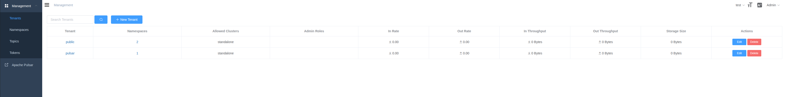

# Apache Pulsar


## What is Apache Pulsar?

[Apache Pulsar](https://pulsar.apache.org/) is a cloud-native, distributed messaging and streaming platform designed for high-throughput, low-latency workloads. It supports both publish-subscribe and message queue semantics, making it suitable for a wide range of real-time data processing scenarios. Pulsar is highly scalable, supports multi-tenancy, and provides strong durability guarantees.

**Key Features:**
- Multi-tenant architecture
- Seamless scalability (horizontally scalable)
- Low latency and high throughput
- Built-in support for geo-replication
- Tiered storage
- Native support for both streaming and queueing use cases

## Configuration
```sh
docker compose up -d

# validate if it's ok
docker exec -it pulsar-manager curl http://pulsar:8080/admin/v2/clusters # -> ["standalone"]

# to create user
CSRF_TOKEN=$(curl http://localhost:7750/pulsar-manager/csrf-token)
curl \
   -H 'X-XSRF-TOKEN: $CSRF_TOKEN' \
   -H 'Cookie: XSRF-TOKEN=$CSRF_TOKEN;' \
   -H "Content-Type: application/json" \
   -X PUT http://localhost:7750/pulsar-manager/users/superuser \
   -d '{"name": "pulsar", "password": "pulsar", "description": "test", "email": "username@test.org"}'
# visit  http://localhost:9527, the created account is admin/apachepulsar
```

## UI
Add a new environment

- Environment name: what you want, maybe `test`, `standalone`, etc.
- Service URL: `http://pulsar:8080`
- Bookie URL: `pulsar://pulsar:6650`

## What is a Bookie in Apache Pulsar?

A **Bookie** comes from Apache BookKeeper and is responsible for **storing data on disk**.

> A storage node that persists messages in Apache Pulsar

## How Pulsar Works

Apache Pulsar is split into two main parts:

### 1. Broker
- Receives messages from producers
- Sends messages to consumers
- Handles communication

### 2. Bookie (Storage)
- Stores messages on disk
- Ensures durability
- Manages logs (called *ledgers*)