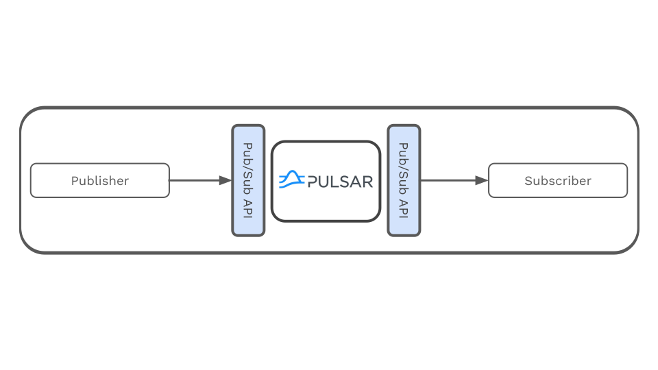
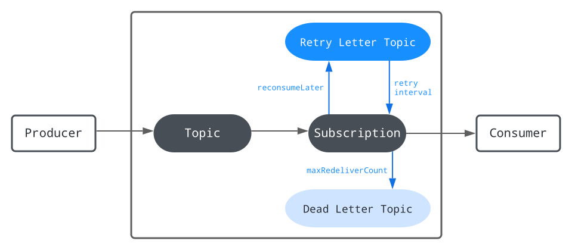
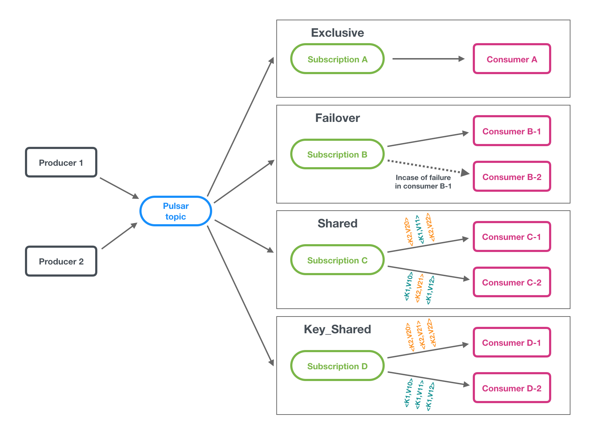
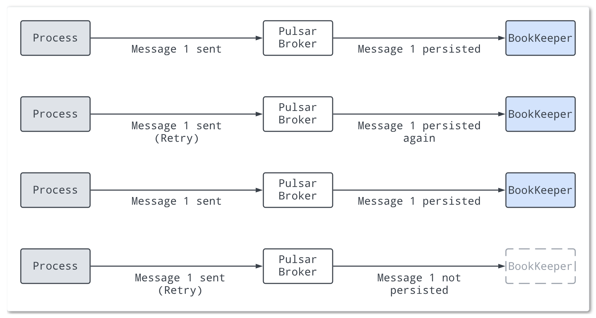
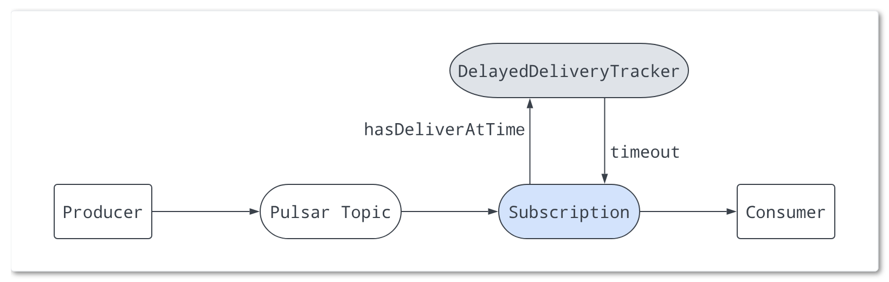

# Apache Pulsar


## What is Apache Pulsar?

[Apache Pulsar](https://pulsar.apache.org/) is a cloud-native, distributed messaging and streaming platform designed for high-throughput, low-latency workloads. It supports both publish-subscribe and message queue semantics, making it suitable for a wide range of real-time data processing scenarios. Pulsar is highly scalable, supports multi-tenancy, and provides strong durability guarantees.

**Key Features:**
- Multi-tenant architecture
- Seamless scalability (horizontally scalable)
- Low latency and high throughput
- Built-in support for geo-replication
- Tiered storage
- Native support for both streaming and queueing use cases

## Messaging
Pulsar is built on the pub-sub pattern. In this pattern, producers publish messages to topics; consumers subscribe to those topics, process incoming messages, and send aknowledgemnts to the broker when processing is finished.  



When a subscription is created, pulsar retains all messages, even if the consumer is disconnected. The retained messages are discarded only when a consumer acknowledges that all these messages are processed successfully.

Messages are the basic unit of pulsar. they are what producers publish to topics and what consumers then consume from topics.

## ACK (Acknowledgement)
A message ack is sent by a consumer to a broker after the consumer consumes a message successfully. Then, this consumed message will be permanently stored and deleted only after all the subscriptions have ack it.

For batch messages, you can enable batch index ack to avoid dispatching ack messages to the consumer. 

Messages can be ack in one of the following two ways:

- Being ack individually
   - the consumer ack each message and sends an ack request to the broker
- Being ack cumulatively
   - The consumer only ack the last message it received. All messages in the stream up to the provieded message are not redelivered to that consumer.

## Retry letter topic
It allows you to store the messages that failed to be consumed and retry consuming them later. You can customize the interval at which the messages are redelivered. Consumers on the original topic are automatically subscribed to the retry leetter topic as well. Once the  maxium number of retries has been reached, the unconsumed messages are moved to a dead letter topic for manual processing. The functionality of a retry letter topic is implemented by consumers.



## Dead letter topic
Dead letter topic allows you continue messages consumption even when some messages are not consumed successfully. The messages that have failed to be consumed are stored in a specific topic, which is called the dead letter topic. The functionally of a dead letter topic is implemented by consumers. You can decide how to handle the messages in the dead letter topic.

## Compression
Messages compression can reduce message size by paying some cpu overhead. The pulsar client supports the following compression types.

- LZ4
- ZLIB
- ZSTD
- SNAPPY

Compression types are stored in the message metadada, so consumers can adopt different compression types automatically, as needed.

## Batching
When a batching is enabled, the producer accumulates and sends a batch of messages in a single request. The batch size is defined by the maxium number of messages and the maximum publish latency. Therefore, the backlog size represents the total number of batches instead of the total number of messages.

## Chunking
Message chunking enables pulsar to process large payload messages by splitting the message into chunks at the producer side and aggregating chunked messages at the consumer side.

With the chunk enabled, when the size of a message exzceeds the allowed maximum payload size, the workflow of message ins as follow:

1. The producer splits the original message into chunked messages and publishes them with chunked metadata to the broker separately and in order
2. The broker stores the chunked messages in one managed ledger in the same way as that of ordinary messages, and it uses the `chunkedmessagerate` parameter to record chunked message rate on the topic.
3. The consumer buffers the chunked messages and aggregates them into the receiver queue when it receives all the chunks of a message
4. The client consumes the aggreated message from the receiver queue.

## Subscriptions
A pulsar sbuscription is a named configuration rule that determines how messages are dlivered to consumers.
Itt is a lease on a ttopic established by a group of consumers. There are fhour subscription types

- **exclusive**: only allows a single consumer to attach to the subscription. If multiple consumers subscribe to a topic using the same subscription, an error occurs. Note that if the topic is partitioned, all partitions will be consumed by the single consumer allowed to be connected to the subscription.

- **shared**: allows multiple consumers tto atttach to the same sbuscripition. Message are delivered in a [round-robin distribution](https://www.ibm.com/docs/en/webmethods-bpm/wte/11.1.0?topic=assignment-about-round-robin-task-distribution) across consumers, and any given message is delivered to only one consumer. When a consumer disconnects, all the messages that were sent to it and not ack will be rescheduled for sending to the remaining consumers.

- **failover**: multiple consumers can attach to the same subscription. A master consumer is picked for a non partitioned topic or each partition of a partitioned topic and receives messages. When the master consumer disconnects, all message are delivedered to the nex consumer in the line.

- **key_shared**: allows multiple consumers to attach to the same subscription. But different with the shared type, message in here are delivered in distribution across consumers and messages with the same key or same ordering key are delivered to only one consumer. No matter how many times the message is re-delivered, it is delivered to the same consumer.



## Multil-topic subscriptions
when a consumer subscribes to a pulsar topic, by default it subscribes to one specific topic. However, pulsar consumers can simultaneously subscribe to multiple topics. you can define a list of topics in two ways

- on the basis o regex
- by explicittly defining a list of topics

## Partitioned ttopics
Normal topics are served only by a single broker, which limits the maximum throughput of the topic. Partitioned topic is a special type of topic handled by multiple brokers, thus allowing for higer throughput.

A partitioned topic is implemented as N internal topics, where N is the number of partitions, when publishing message to this kind of topic, each message is routed to one of several brokers. The distribution of partitions across brokers is handled automatically by pulsar.

## Routing modes
when publishing to partitioned topics, you must specify a routing mode. The rounting mode determines each messages should be published to which partition or which internal topic.

- **ound robin partition**: will publish messages across all partitions in round-robin fashion to achieve maximum throughput.
- **Single partition**: will randomly pick one single partition and publish all the messages into that partition.
- **Custom Parition**: use custom message routter implementation that will be called to determine the partition for a partticular message. User can create a custom routing mode by using java client and implementing the message router interface.

## Non persistent topics
By default, pulsar persistently stores all unack messages on multiple book keeper brookies (storage nodes). Data for message on persistent topics can thus survive broker restarts and subscriber failover.

However, supports non persistent topics. Non persistent topics are pulsar topics in which message data is never persistently stored to disk and kept only in memory. when using non persitent delivery, killing a pulsar broker or disconnecting a subsriber tto a topic means that all in transit messagess are lost on that topic, meaning that clients may see message loss.

Non persistent topics have names of this form

```sh
non-persistent://tenant/namespace/topic
```

## System topic
System topic is a predefined topic for internal use witthin pulsar. It can be eitther a persistent or non persistent topic.

## Message redelivery
Apache pulsar supportts graceful failure handling an ensures critical data is not lost. Software will always have unexpected conditions and at times messages may not be delivered successfully. Therefore, it is important to have a built-in mechanism that handles failure, particulalrly in asynchronous messageing as highlighted in the following examples.

- consumers get disconnected from the database or the HTTP server. When this happens, the database is temporarily offline while the consumers is writing the data to it and the external HTTP server tthat the consumer calls are momentarily unavailable.
- Cnonsumers gett disconnected from a broker due to consumer crashes, broken connections, etc. As a consequence, unack messages are delivered to other available consumers.

MMessage redelivery in Apache Pulsar avoids failure in asynchronous messaging and other message delivery failures using at-least-once delivery semantics that ensure Pulsar processes a message more than once.

To utilize message redelivery, you need to enable this mechanism before the broker can resend the unack messages in Pulsar client. you can activate the message redelivery mechanism in Pulsar using three methods

- Negative ack
- ack timeout
- Retry letter topic

## Message retention and expiry
By default, Pulsar message brokers:

- Immediately delete all messages that have been acknowledged by a consumer
- persistently store all unacknowledged messages in a message backlog

Pulsar has two features, however, that enable you to override this default behavior

- Message retention enables you tto store messages that have been ack by a consumer
- Message expiry enables you to set a time to live (TTL) for messages that have not yet been ack.

> All message retention and expiry are managed at the namespace level.

with message retention, shown at the ttop, a retenttion policy applied tto all topics in a namespace dicttates thatt some message are durably stored in Pulsar even though tthey have already been acknowledged. Acknowledged messages tthat are not covered by the retention policy are deleted. Without a retention policy, all of the acknowledged messages would be deleted. 

With message expiry, shown at the bottom, some messages are deletted, even though they haven't been acknowledged, because they have expired according tto the TTL applied to the namespace (for example because a TTTL of 5 minutes has been applied and the messages haven't been acknowledged but are 10 minutes old).

## Message deduplication
Message duplication occurs when a message is persisted by pulsar more than once. Message deduplication ensures that each message produced on Pulsar topics is persisted to disk only once, even if the message is produced more than once. Message deduplication is handled automatically on the server side.



Message deduplication is disabled in the scenario shown at the top. Here, a producer publishes message 1 on a topic; tthe message reaches a Pulsar broker and is persisted to BookKeeper. The producer then sends message 1 again (in this case due to some retry logic), and the message is received by the broker and sotred in bookKeeper again, which means that duplication has occured.

In the second snceario at the bottom, the producer publishes message 1, which is received by the broker and persisted, as in the first scenario. When the producer attempts to publish the message again, howver, the b roker knows that it has already seen message 1 and thus does not persist the message.

> Message deduplication is handled at the namespace level or the topic level.

### Producer idempotency
Tthe other available approach to message deduplicattion is producer idempotency, which means each message is only produced once without data loss and duplication. The drawback of this approach is that itt defers the work of message deduplicattion to the application. In pulsar, this is handled at the broker level, so you do not need to modify your pulsar client code. Insttead, you only need to make administrative changes.

## Delayed message delivery
Delayed message delivery enables you to consume a messages later. In this mechanism, a message is sttored in BookKeeper. The `DelayedDeliveryTracker` maintains the time index (time > messageId) in memory after the message is published to a broker. This message will be delivered to a consumer once the specified delay is over.



A broker saves a message without any check. When a consumer consumes a message, if the message is set to delay, then the message is added to `DelayedDeliveryTacker`. A subscription checks and gets timeout messages from `DelayedDeliveryTracer`.

> Delayed message delivery is enabled by default, you can change it in the broker configurations file.

## Architecture

### Brokers
Broker is a stateless component thatt's primarily responsible for running two other components:

- An HTTP server that exposes a REST API for both administrative tasks and topic lookup for producers and consumers. The producers connectt to the brokers to publish messages and the consumers connect to the brokers tto consume the messages.
- A dispatcher, which is an asynchronous TCP server over a custom binary protocol used for all data transfer.

### Clusters
A pulsar insttance consists of one or more pulsar clustters. Clusters, in turn, consist of:

- One or more pulsar brokers
- A zookeeper quorum used for clustter-level configurattion and coordination
- An ensemble of bookies used for persistent storage of messages

Clusters can replicate among tthemselves using geo-replication.

### Metadata store
The pulsar mettadata store maintains all the metadata of a pulsar clustter, such as topic metadata, schema, broker load data, and so on. Pulsar supports multiple metadata store backends tto provide flexibility in deployment architectures and operational requirements.

#### Supported metdata store backends
- Apache zookeeper
- etcd
- rocksdb
- oxia

### Configuration store
The configuration store is a zookeeper quorum that is used for configurattion-specific tasks and it maintains all the configurations of a pulsar instance, such as clusters, tenants, namespaces, partitioned topic-related configurations, and so on. A pulsar instance can have a single local cluster, multiple local clustters, or multiple cross-region clusters. Consequently, the configuration store can share the configurations across multiple clusters under a pulsar instance. The configuration sttore can be deployed on a separate zookeeper cluster or deployed on an existing zookeeper cluster.

### Persistent storage
Pulsar provides guaranteed messages delivery for applications. If a message successfully reaches a pulsar broker, it will be delivered to its intended target.

This guarantee requires tthat non-acknowledeged messages are stored durably until they can be delivered to and acknowledeged by consumers. This mode of message is commonly called persistent messageging. In pulsar, N copies of all messages are sttored and synced on disk.

### Pulsar proxy
One way for pulsar clients to interact with a Pulsar cluster is by connecting to pulsar message brokers directly. In some cases, however, this kind of direct connection is either infeasible or undesirable because the client doesn't have directt access to broker addresses. If you're running pulsar in a cloud environment or on K8S or an analogous platform, for example, then direct client connections to brokers are likely not possible.

The pulsar proxy provides a solution to this problem by acting as a single gateway for all of the brokers in a cluster. If you run the pulsar proxy (which, again, is optional), all client connections with the pulsar cluster will flow through the proxy rather than communicatting with brokers.

> For the sake of performance and fault tolerance, you can run as many instance of the pulsar as you would like.

### Service discovery
Is a mechanism that enables connectting clients to use just a single URL to interact with an entire Pulsar instance.
You can use your own service discovery system if you would like. If you use your own system, there is just one requirement: when a client performs an HTTP request to an endpoint, such as `http://pulsar...`, tthe client needs to be redirected to some active broker in the desired cluste, whether via DNS, an HTTP or IP redirect, or some other means.

## Configuration
```sh
docker compose up -d

# validate if it's ok
docker exec -it pulsar-manager curl http://pulsar:8080/admin/v2/clusters # -> ["standalone"]

# to create user
CSRF_TOKEN=$(curl http://localhost:7750/pulsar-manager/csrf-token)
curl \
   -H 'X-XSRF-TOKEN: $CSRF_TOKEN' \
   -H 'Cookie: XSRF-TOKEN=$CSRF_TOKEN;' \
   -H "Content-Type: application/json" \
   -X PUT http://localhost:7750/pulsar-manager/users/superuser \
   -d '{"name": "pulsar", "password": "pulsar", "description": "test", "email": "username@test.org"}'
# visit  http://localhost:9527, the created account is admin/apachepulsar
```

## UI
Add a new environment

- Environment name: what you want, maybe `test`, `standalone`, etc.
- Service URL: `http://pulsar:8080`
- Bookie URL: `pulsar://pulsar:6650`

## What is a Bookie in Apache Pulsar?

A **Bookie** comes from Apache BookKeeper and is responsible for **storing data on disk**.

> A storage node that persists messages in Apache Pulsar

## How Pulsar Works

Apache Pulsar is split into two main parts:

### 1. Broker
- Receives messages from producers
- Sends messages to consumers
- Handles communication

### 2. Bookie (Storage)
- Stores messages on disk
- Ensures durability
- Manages logs (called *ledgers*)